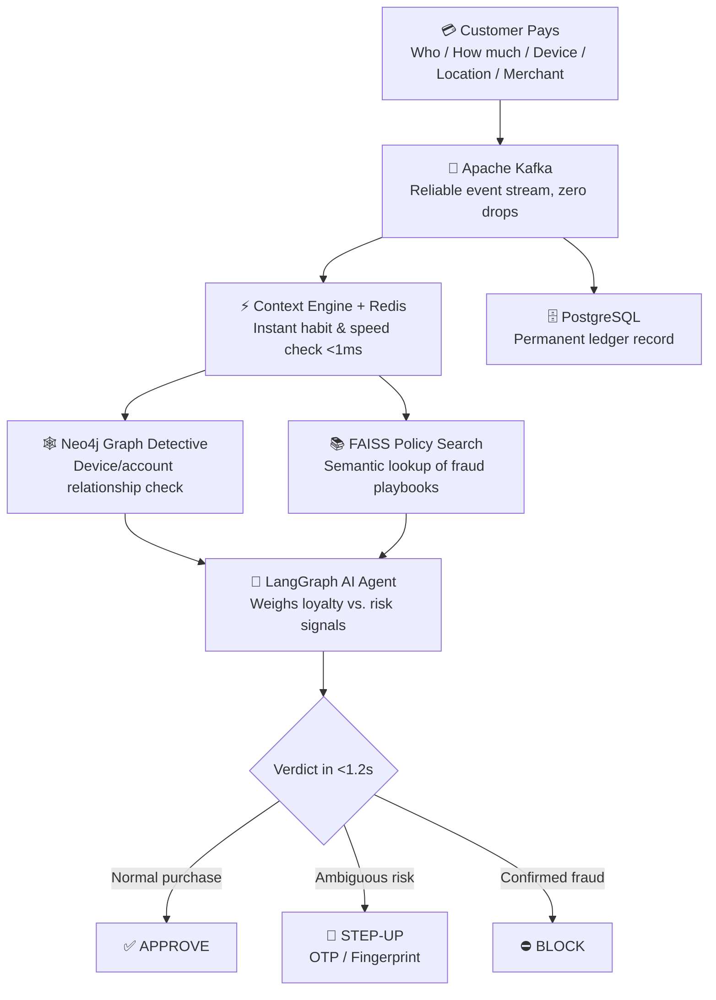

# AI-Native Payments Intelligence
### Real-Time Fraud Prevention System

**Goal:** Stop payment fraud in under 1 second — without annoying good customers.

| | |
|---|---|
| **Core Intelligence** | Graph Relationships (Neo4j) + Smart Agent (LangGraph) |
| **Target Speed** | Instant Check `<100ms` · AI Reasoning `<1.2s` |
| **Tech Stack** | Kafka · Redis · PostgreSQL · Neo4j · FAISS · LangGraph · Docker |

### Guiding Team Principles
1. Working System > Theoretical perfection
2. True Understanding > Blind copy-pasting code
3. Measured Numbers > Impressive but fake claims
4. Good Architecture First > Fast coding second

---

## 1. The Problem

Traditional card/check payments took 2–3 days to settle, giving banks time to catch fraud. Today's instant-payment rails (UPI, FedNow, Pix) move money in under 2 seconds, 24/7. Once it's gone, it's gone — banks must now decide if a payment is safe in **under one second**.

### 1.1 The Numbers

| Source | Loss | What It Means |
|---|---|---|
| The Nilson Report (Card Fraud) | $33.41B (2024) → $403B by 2035 | US alone suffers 42% of world card fraud |
| FTC (Consumer Scams) | $12.5B (2024) → $15.86B (2025) | Scams jumped 25% in a year |
| LexisNexis (True Cost) | $4.00–$5.75 lost per $1 stolen | A $100 theft can cost banks up to $575 |
| Merchant Risk Council (False Declines) | $400B+ lost yearly | 13x bigger than fraud itself; 1 in 3 falsely-declined customers never returns |

### 1.2 Real-World Fraud Patterns
- **Account Takeover** — stolen password + spoofed location → high-value purchase approved because credentials "looked" correct.
- **Mule Networks** — 50 fake accounts, aged for months, all controlled from one device, cashed out simultaneously.
- **Our Test Case (TXN-004521)** — an 8-year loyal user who normally spends ~₹3,000 suddenly pays ₹48,500 from an unrecognized device to a brand-new merchant. Old systems either block a good customer or approve fraud; our system reasons through it.

---

## 2. How the Industry Solves This

| Company | Method | Stack |
|---|---|---|
| Stripe Radar | ML on billions of transactions, decision trees | Kafka, RocksDB, feature stores |
| Feedzai | Cross-channel behavioral monitoring | Kafka, Flink/Spark, Cassandra |
| Sardine | Behavioral biometrics + AI investigators | Kafka, Neo4j, WebSockets |
| Sift | Global network graph for identity fraud | Graph DBs, Spark, Supervised ML |
| Visa (VAA) | 500 risk signals in 50ms | Custom mainframes, in-memory neural chips |

---

## 3. Why Old Systems Fail

1. **Humans are too slow** — 15–30 min review vs. a 2-second payment window.
2. **Static rules are gameable** — fraudsters simply stay just under thresholds.
3. **SQL can't see hidden networks** — multi-hop joins to detect shared devices freeze under load.
4. **Honest customers get blocked** — costing $400B+ annually in lost trust.
5. **No explainability** — a score of "82" doesn't answer regulators or customers.

---

## 4. System Architecture

Every transaction is fully evaluated in under 1.2 seconds:

### Step-by-Step
1. **Customer Pays** — capture who, how much, device, location, merchant.
2. **Kafka** — the unbreakable conveyor belt; no payment lost even at 50,000 concurrent buys.
3. **Redis + PostgreSQL** — Redis flags abnormal spend (e.g., 16x normal) in <1ms; Postgres logs the permanent receipt.
4. **Neo4j** — detects if this device/account was linked to prior fraud.
5. **FAISS** — retrieves the matching policy (e.g., "15x spend on unverified device → step-up verification") in ~5ms.
6. **LangGraph Agent** — balances competing signals (loyal customer vs. risky device) like a human expert.
7. **Outcome** — `APPROVE`, `STEP-UP/FLAG`, or `BLOCK`, returned in under 1.2 seconds.

---

## 5. Tech Stack & Why

| Tool | Purpose | Why Chosen | Trade-off |
|---|---|---|---|
| **Kafka** | Event streaming | Zero dropped payments, replayable, burst-proof | Higher memory/setup cost |
| **Redis** | Hot in-memory habits | <1ms lookups | RAM is costlier than disk |
| **PostgreSQL** | Bank ledger | ACID-safe, compliance-ready | Slower for graph-style queries |
| **Neo4j** | Relationship graph | Finds hidden fraud rings in milliseconds | Requires learning Cypher |
| **FAISS** | Semantic policy search | Finds the right rule in ~5ms | Must reload on policy updates |
| **LangGraph** | AI reasoning agent | Structured, explainable decisions | 0.5–1.2s per call (only run on suspicious cases) |
| **Docker Compose** | One-command setup | Any dev can spin up the full stack | Built for dev/test, not multi-cloud scale |

---

## 6. Our System vs. Traditional Approaches

| Capability | Manual Review | Hardcoded Rules | **Our AI-Native System** |
|---|---|---|---|
| Decision Speed | 15 min – 24 hrs | 10–50ms | **<100ms instant / ~1.2s AI verdict** |
| Traffic Spikes | Crashes | Handles volume, many errors | **5,000+ TPS via Kafka** |
| Catching Mule Rings | Nearly impossible | Blind to it | **Neo4j spots shared devices in ~5ms** |
| False Rejections | Too slow to matter | Very high ($400B lost) | **<2%** |
| Learning New Scams | Staff retraining | New code required | **Add playbook to FAISS instantly** |
| Operating Cost | Very high (staffing) | High maintenance | **Low, automated** |
| Explainability | Brief analyst notes | Meaningless error codes | **Full plain-English audit report** |

---

## 7. Two-Day Sprint Roadmap

### Day 1 — Architecture & Foundation
- Define data contracts (JSON schemas for events & risk scores)
- Defend tech decisions (Kafka, Neo4j, LangGraph rationale)
- Scaffold Docker Compose (Kafka, Redis, Postgres, Neo4j)
- Write the architecture note

### Day 2 — Build the First Vertical Slice
- Transaction simulator generating realistic test events
- Kafka → Context Service event pipeline
- Redis counters + PostgreSQL receipts
- Seed Neo4j with sample users/devices/scam flags
- Load fraud policies into FAISS
- Wire up LangGraph AI decision agent
- Simple live dashboard & API (transactions, graph links, decisions)

---

## License
Add your license here.
